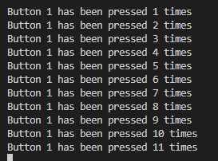

# Practica 2 Interrupciones

En esta practica conoceremos el funcionamiento de las interrupciones que pueden ser detonadas por un evento de Hardware un timer o una llamdada por software.

Trabajaremos las interruciones por hardware y timer.
# Parte A
En esta parte de la practica ulizaremos un boton para llamar a la interrupcion, es decir una llamada por hardware.
Esta interrupcion suspendera el la ejecucion normal del procesador y una vez ejecutada la interrupción volvera a la actividad normal del procesador justo donde se dejo, este proceso se llama ISH (servicio de gestión de interrupción).

# Código
```cpp
#include <Arduino.h>

struct Button {
  const uint8_t PIN;
  uint32_t numberKeyPresses;
  bool pressed;
};

Button button1 = {18, 0, false};

void IRAM_ATTR isr() {
  button1.numberKeyPresses += 1;
  button1.pressed = true;
}

void setup() {
  Serial.begin(115200);
  pinMode(button1.PIN, INPUT_PULLUP);
  attachInterrupt(button1.PIN, isr, FALLING);
}

void loop() {
  if (button1.pressed) {
      Serial.printf("Button 1 has been pressed %u times\n", button1.numberKeyPresses);
      button1.pressed = false;
  }

  //Detach Interrupt after 1 Minute
  static uint32_t lastMillis = 0;
  if (millis() - lastMillis > 60000) {
    lastMillis = millis();
    detachInterrupt(button1.PIN);
     Serial.println("Interrupt Detached!");
  }
}
```

**Creacion de la tupla botón**
```cpp
struct Button {
  const uint8_t PIN;
  uint32_t numberKeyPresses;
  bool pressed;
};
```
Primero de todo crearemos una tupla boton con las siguientes variables:

PIN: Con esta variable definimos el pin que utilizaremos en la placa es del tipo uint8_t para optimizar la memoria del microprocesador.


numberKeyPresses:emos Esta variable consiste en un contador que asignaremos a las veces que hemos presionado el botón y es del tipo uint32_t.

pressed: Esta variable del tipo bool nos definira si el botón esta presionado o no.

```cpp
Button button1 = {18, 0, false};// creamos un boton llamado 1, definido en pin 18
```


**Creacion Interrupción**
```cpp
void IRAM_ATTR isr() {
  button1.numberKeyPresses += 1;
  button1.pressed = true;
}
```
Aqui se define la funcion isr que seran las acciones que se ejecutaran cuando se active la interrupcion, sumaremos +1 a la variable numberKeypressed y estableceremos la varieable pressed en true para indicar que hemos pulsado el botón.


**Setup**
```cpp
void setup() {
  Serial.begin(115200);
  pinMode(button1.PIN, INPUT_PULLUP);
  attachInterrupt(button1.PIN, isr, FALLING);
}
```
En el setuo iniciaremos el Serial, configuraremos en pin para que este preparado para detectar cuando se presiona el botón mediante el INPUT_PULLUP y por ultimo configuramos la interrupcion con el pin del botón y la funcion isr creada previamente.

**LOOP**
```cpp
void loop() {
  if (button1.pressed) {
      Serial.printf("Button 1 has been pressed %u times\n", button1.numberKeyPresses);
      button1.pressed = false;
  }

  //Detach Interrupt after 1 Minute
  static uint32_t lastMillis = 0;
  if (millis() - lastMillis > 60000) {
    lastMillis = millis();
    detachInterrupt(button1.PIN);
     Serial.println("Interrupt Detached!");
  }
}
```

En el void loop mostraremos a traves del serial cuantas veces hemos presionado el botón durante un lapso de 60000ms 
Utilizamos la funcion millis para no bloquear el procesador con un delay, una vez haya pasado el tiempo la interupcion se desconectara es decir el microprocesador dejara de revisar si hay alguna accion en el pin previamente configurado.




